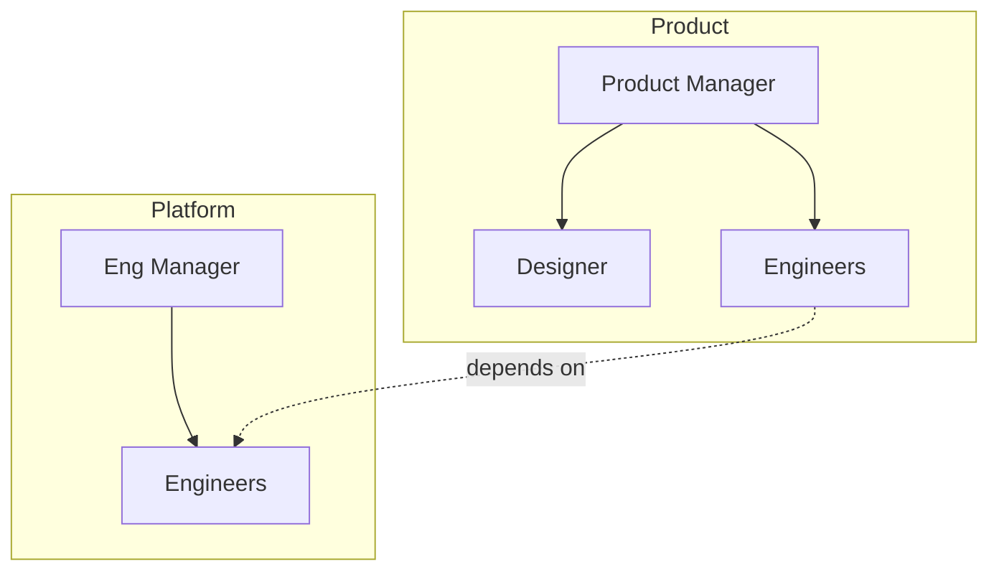

# Organizational Design

## Workspace Input → Recommendation Output

This skill consumes a structured workspace of inputs and produces a `recommendation.md` in the workspace root.

### Expected Workspace Structure

Users bring a workspace with some or all of these folders populated:

```
workspace/
├── benchmarks/           # External examples and case studies
│   └── *.md
├── interview-notes/      # Stakeholder interviews
│   └── {person-name}.md
├── identified-problems/  # Known or suspected issues
│   └── *.md
├── role-definitions/     # Current or proposed roles
│   └── *.md
├── solutions/            # Interventions under consideration
│   └── *.md
├── outputs/              # What the group produces
│   └── *.md
├── outcomes-data/        # Quantitative data
│   └── *.csv
└── recommendation.md     # ← CLAUDE PRODUCES THIS
```

### Input Folders

**benchmarks/** — External examples the user has gathered. How other companies structured similar teams, industry patterns, research summaries. Use these to inform and validate recommendations.

**interview-notes/** — Notes from stakeholder conversations. Named by person (e.g., `sarah-chen.md`). Contains their perspective on current state, pain points, what success looks like. Primary qualitative data source.

**identified-problems/** — Issues the user has already identified or suspects. May be incomplete—use interview notes and data to validate, refine, or discover additional problems.

**role-definitions/** — Current role definitions for the org being analyzed. Use to identify gaps, overlaps, and mismatches between accountability and authority.

**solutions/** — Interventions the user is already considering. Evaluate these against the diagnosed problems; recommend among them or suggest alternatives.

**outputs/** — What the team/org produces (products, services, deliverables). Understanding outputs helps design structure around value creation.

**outcomes-data/** — CSVs with business metrics (revenue, velocity, quality), people analytics (turnover, engagement, tenure), operational data (cycle time, incidents). Use to validate qualitative findings and quantify impact.

### Output: recommendation.md

After reading the workspace inputs, produce `recommendation.md` in the workspace root with this structure:

```markdown
# Organizational Design Recommendation

## Executive Summary
2-3 paragraphs: key findings, primary recommendation, expected impact

## Current State Assessment

### What This Org Produces
Summary from outputs/

### How It's Currently Structured
Summary from role-definitions/

### What the Data Shows
Key patterns from outcomes-data/

## Diagnosis

### Validated Problems
Problems confirmed by multiple sources (interviews + data + observation)
- Link to evidence in workspace files

### Additional Problems Identified
Issues discovered through analysis that weren't in identified-problems/

### Root Cause Analysis
Underlying structural or dynamic issues driving the symptoms

## Options Considered

### Option 1: [Name]
- Summary
- Addresses: [which problems]
- Tradeoffs
- Implementation requirements

### Option 2: [Name]
...

### Option 3: [Name]
...

(Include solutions from solutions/ folder plus any new options)

## Recommendation

### Primary Recommendation
What to do and why

### Implementation Approach
Sequencing, dependencies, quick wins vs. longer-term changes

### Success Metrics
How to know if the intervention is working

### Risks and Mitigations
What could go wrong and how to address it

## Appendix

### Evidence Summary
Key quotes and data points organized by theme

### Benchmark Applicability
Which benchmarks informed the recommendation and why
```

## Working Process

### 1. Read the Workspace

Read inputs in this order:

1. `outputs/` — Understand what value this org creates
2. `outcomes-data/` — Ground yourself in quantitative reality
3. `interview-notes/` — Hear from stakeholders in their words
4. `role-definitions/` — Understand current structure
5. `identified-problems/` — See what's already been diagnosed
6. `solutions/` — Know what's being considered
7. `benchmarks/` — Understand available patterns

### 2. Synthesize and Validate

- **Triangulate**: Do interviews, data, and identified problems tell a consistent story?
- **Fill gaps**: What problems are evident in interviews but not in identified-problems/?
- **Challenge assumptions**: Do the solutions in solutions/ actually address root causes?
- **Apply benchmarks**: Which external patterns fit this context?

### 3. Generate Recommendation

- Diagnose root causes, not just symptoms
- Generate multiple options (including from solutions/ folder)
- Evaluate tradeoffs for each option
- Make a clear recommendation with rationale
- Trace everything back to evidence in the workspace

### 4. Write recommendation.md

Produce the recommendation file in the workspace root with full traceability to input files.

---

## Core Framework: Two Traditions

Org design draws from two traditions that are complementary, not competing:

**Structuralist** (the architecture): Reporting lines, team boundaries, role definitions, decision rights, information flows, coordination mechanisms. Answers "who reports to whom" and "who decides what."

**Mutualist** (the relationships): Culture, trust, psychological safety, team dynamics, development, how people actually work together. Answers "how do people collaborate" and "how do we grow."

Effective org design integrates both. Structure without culture creates bureaucracy. Culture without structure creates chaos.

## Diagnostic Questions

When analyzing, systematically consider:

### Structure
- Are accountabilities clear? Can people answer "who owns this?"
- Do decision rights match accountability? (Authority without responsibility or vice versa)
- Are there coordination gaps? (Work falling between teams)
- Are there coordination overloads? (Too many dependencies, too many meetings)
- Does span of control make sense? (Too flat = manager spread thin; too deep = slow decisions)
- Are there shadow structures? (Informal structures doing what formal structures should)

### Dynamics
- Is there psychological safety to surface problems?
- Are conflicts productive or destructive?
- Do teams have shared context or are they siloed?
- Is there trust between interdependent groups?
- Are there development paths for people?

### Symptoms to Patterns

| Symptom | Likely Patterns |
|---------|-----------------|
| Decisions take forever | Unclear decision rights, too many stakeholders, missing RACI |
| Things fall through cracks | Accountability gaps, unclear ownership, poor handoff design |
| Constant firefighting | Insufficient capacity, poor prioritization mechanisms, missing escalation paths |
| Siloed teams | Missing coordination roles, no shared goals, communication structure gaps |
| Meeting overload | Compensation for unclear roles, missing async mechanisms, poor information flow |
| Talent leaving | Role ambiguity, no growth paths, accountability without authority |

## Intervention Principles

1. **Diagnose before prescribing** — Symptoms often point to different root causes. An org chart change won't fix a trust problem.

2. **Structure follows strategy** — Design the org to execute the strategy, not the other way around. Ask "what do we need to be great at?"

3. **Minimize coordination cost** — Group work that requires tight coordination. Separate work that can be independent. Reduce dependencies where possible.

4. **Design for the 80%** — Optimize for common cases. Handle exceptions through escalation, not structural complexity.

5. **Preserve optionality** — Reversible changes over irreversible. Pilot before scaling.

6. **Both/and over either/or** — Integrate structuralist and mutualist interventions. Changing boxes without changing behaviors rarely works.

## Common Patterns

For detailed pattern descriptions, see:
- [references/structural-patterns.md](references/structural-patterns.md) — Team topologies, coordination mechanisms, decision frameworks
- [references/diagnostic-patterns.md](references/diagnostic-patterns.md) — Common dysfunctions and their signatures

## Mermaid Diagrams

For org structure visualization in recommendation.md, use Mermaid flowcharts:



Use solid lines for reporting, dashed for dependencies/coordination.
