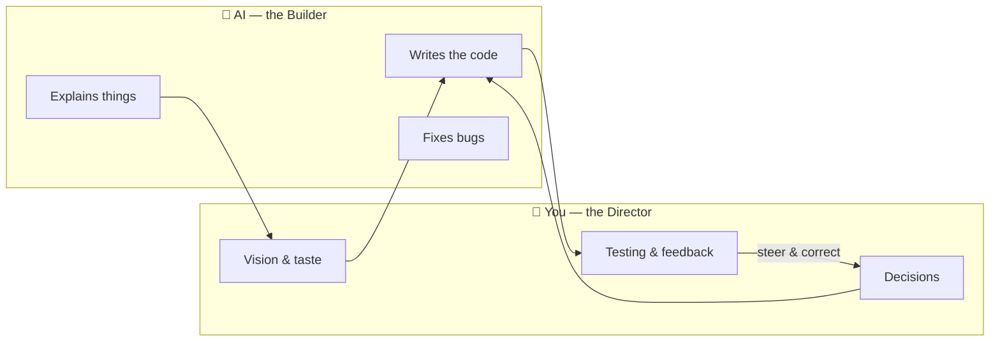
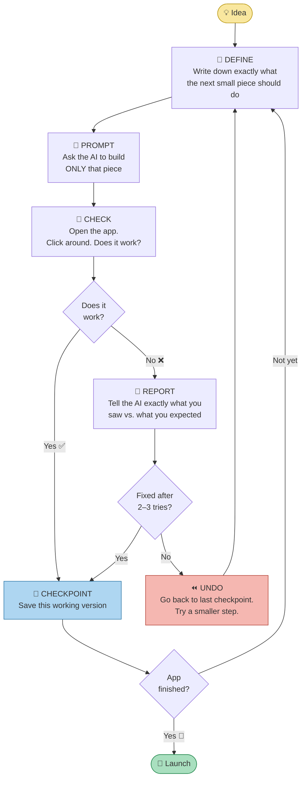
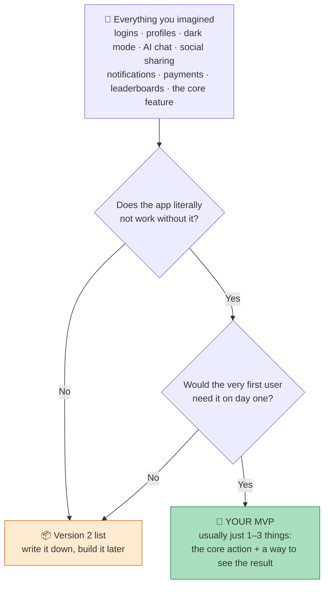
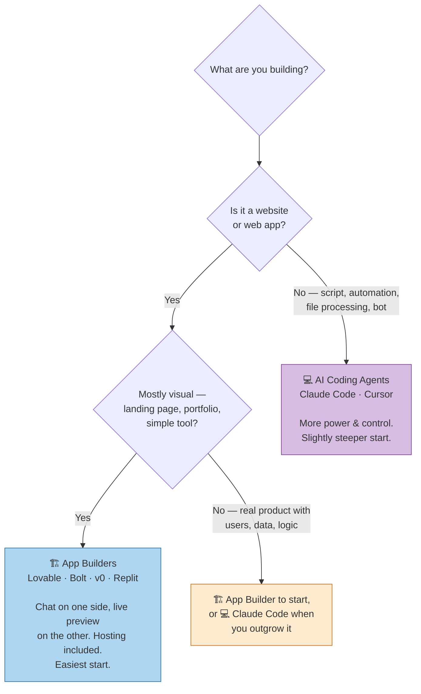
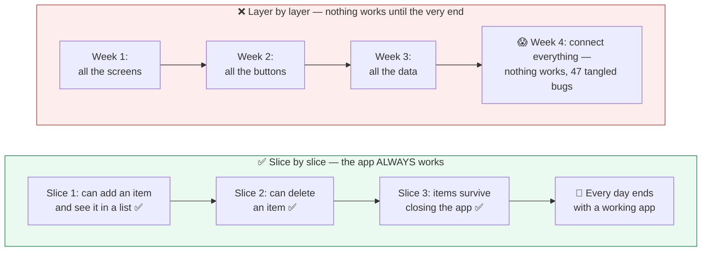
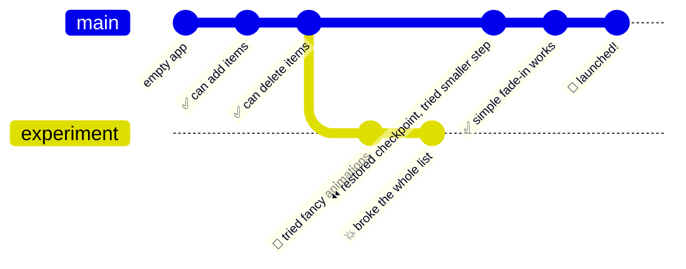
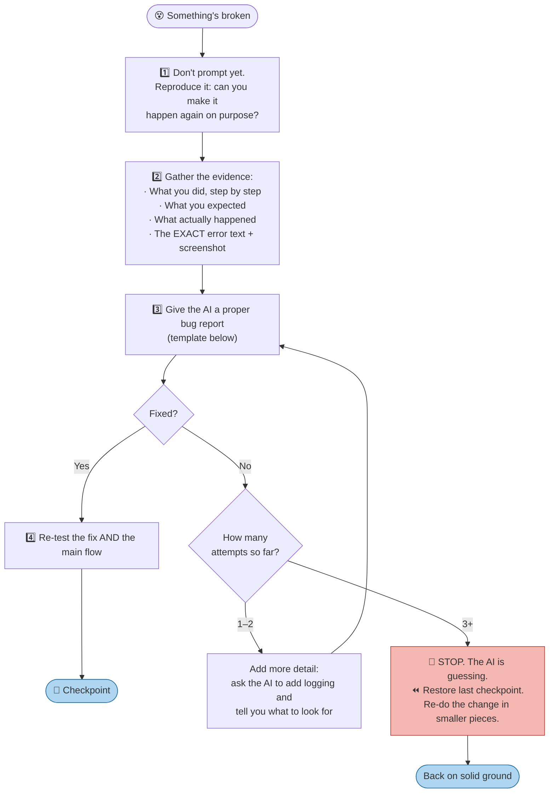
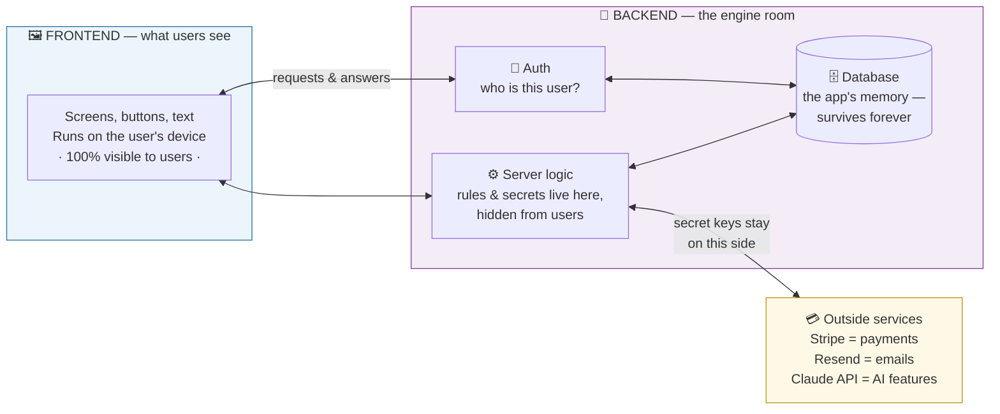
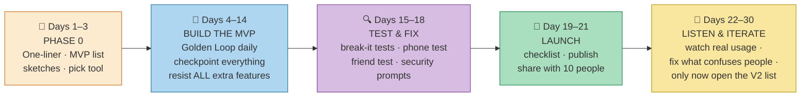

# 🎸 The Vibe Coder's Guide to Building a Good App
### A complete playbook for non-developers — from idea to launched app, without the mistakes

> **Who this is for:** You don't write code. You have ideas. You want to use AI tools (Claude, Lovable, Cursor, Bolt, v0…) to build real apps. This guide teaches you the *process* that separates people who ship great apps from people who end up with a broken mess after 3 days.
>
> **How to read it:** Top to bottom the first time. After that, jump to the phase you're in. Every diagram below renders automatically on GitHub — view this file on github.com to see them as real charts.

---

## Table of Contents

1. [The Big Picture: What Vibe Coding Actually Is](#1-the-big-picture)
2. [The Golden Loop — the one diagram to remember](#2-the-golden-loop)
3. [Phase 0 — Define Your App (before touching any tool)](#3-phase-0--define-your-app)
4. [Phase 1 — Pick Your Tool](#4-phase-1--pick-your-tool)
5. [Phase 2 — Plan With the AI First](#5-phase-2--plan-with-the-ai-first)
6. [Phase 3 — Build in Small Slices](#6-phase-3--build-in-small-slices)
7. [Checkpoints: Your Undo Button](#7-checkpoints-your-undo-button)
8. [Phase 4 — Test Like a User](#8-phase-4--test-like-a-user)
9. [Debugging Without Panic](#9-debugging-without-panic)
10. [Security Basics You Cannot Skip](#10-security-basics)
11. [Accounts, Databases & Payments — when you need a backend](#11-when-you-need-a-backend)
12. [Phase 5 — Launch Checklist](#12-phase-5--launch-checklist)
13. [The 12 Deadly Mistakes (and how to dodge every one)](#13-the-12-deadly-mistakes)
14. [Copy-Paste Prompt Cheat Sheet](#14-prompt-cheat-sheet)
15. [Glossary — jargon, translated](#15-glossary)
16. [Your First 30 Days — a realistic roadmap](#16-your-first-30-days)

---

## 1. The Big Picture

**Vibe coding** = you describe what you want in plain language, an AI writes the code, you look at the result, and you steer. You are not the programmer. You are the **director**. The AI is a very fast, very knowledgeable, slightly forgetful film crew.

The mindset shift that changes everything:

| ❌ How beginners think | ✅ How successful vibe coders think |
|---|---|
| "I'll describe my whole app and the AI will build it" | "I'll build one small piece, check it works, then add the next" |
| "The AI knows what I mean" | "The AI knows only what I *wrote*. Vague in = vague out" |
| "Something broke, I'll ask it to fix everything" | "Something broke, I'll undo to my last checkpoint and try a smaller step" |
| "More features = better app" | "One feature that works perfectly beats ten that half-work" |
| "I'll test it when it's finished" | "I test after *every single change*" |



**The core truth:** the quality of your app is decided by the quality of your *process*, not your technical knowledge. This guide is that process.

---

## 2. The Golden Loop

If you remember only one thing from this entire guide, remember this loop. Every good app — built by professionals or vibe coders — comes out of this cycle:



**Why this works:** every trip around the loop is small, so when something breaks (and it will), you know *exactly* which change caused it — it was the last one. People who skip the loop and ask for everything at once end up with 47 problems tangled together and no idea where to start.

⏱️ A healthy loop takes **5–20 minutes** per lap. If a single lap has taken over an hour, your step was too big. Undo, split it in half, go again.

---

## 3. Phase 0 — Define Your App

**Do not open any AI tool yet.** The #1 cause of failed vibe-coding projects is starting to build before knowing what you're building. Grab a note app or paper and answer these four questions:

### 3.1 The One-Liner

Fill in this template — if you can't, you're not ready to build:

> **"[App name] helps [specific person] do [specific thing] so that [specific benefit]."**

✅ Good: *"ShelfScan helps home cooks track pantry items so they stop buying duplicates."*
❌ Bad: *"An app for food stuff with AI."*

### 3.2 The One Core Action

Every great app has ONE action users do over and over. Instagram = post a photo. Uber = request a ride. What's yours?

### 3.3 Cut to the MVP

MVP = **Minimum Viable Product** — the smallest version that's still useful. Take your feature wishlist and run it through this funnel:



**Brutal rule of thumb:** your MVP is smaller than you think. No logins, no settings page, no dark mode. Those are all Version 2. A pantry app's MVP is: *add an item, see the list, remove an item.* That's it.

### 3.4 Sketch the Screens

Draw your screens with a pen. Boxes and arrows. Ugly is fine. Three reasons:

1. It forces you to make layout decisions *before* the AI makes them for you.
2. You can photograph the sketch and give it to the AI — modern tools read images.
3. If you can't sketch it, you don't understand it yet.

**Phase 0 output:** one page containing your one-liner, core action, MVP list (1–3 items), Version-2 list, and screen sketches. This page is worth more than 100 prompts.

---

## 4. Phase 1 — Pick Your Tool

There are two families of tools. Pick based on what you're building, not on hype:



| | 🏗️ App Builders (Lovable, Bolt, v0, Replit) | 💻 Coding Agents (Claude Code, Cursor) |
|---|---|---|
| **Feels like** | Chatting next to a live preview of your app | Directing a developer in a workshop |
| **Best for** | Web apps, landing pages, dashboards, MVPs | Anything — apps, scripts, automations |
| **Hosting** | Built in — click "publish" and it's live | You set up (AI walks you through it) |
| **Undo/checkpoints** | Built-in version history | Git (see [Section 7](#7-checkpoints-your-undo-button)) |
| **When it hurts** | Very custom logic, unusual integrations | First-hour setup is more technical |
| **Start here if…** | You want results in the next 30 minutes | You want maximum control & room to grow |

**Advice:** start with ONE tool and stick with it for your whole first project. Tool-hopping mid-project is one of the deadly mistakes ([#9](#13-the-12-deadly-mistakes)).

---

## 5. Phase 2 — Plan With the AI First

Before asking for any code, have a *conversation*. Every serious tool has a planning or chat mode (Claude Code has "plan mode"; Lovable has plan-first messages). Use this opening prompt, filling in your Phase-0 page:

> **The Kickoff Prompt** *(copy, fill in, paste)*
> ```
> I'm a non-developer building my first app with your help. Before writing
> any code, I want to agree on a plan.
>
> THE APP: [your one-liner]
> CORE ACTION: [the one thing users do repeatedly]
> MVP FEATURES (only these — nothing more):
>   1. [feature]
>   2. [feature]
>   3. [feature]
> EXPLICITLY NOT BUILDING YET: logins, payments, [your V2 list]
>
> Please:
> 1. Propose the simplest possible technical approach. Optimize for
>    simplicity and fewer moving parts, not for what's trendy.
> 2. Break the build into small steps I can test one at a time —
>    each step should leave the app in a working state.
> 3. Tell me anything about my idea that is unclear or risky BEFORE we start.
> 4. Explain your plan in plain language, no unexplained jargon.
> ```

Why each line matters:

- **"Simplest possible approach"** — otherwise AIs sometimes reach for complex, trendy setups you can't maintain.
- **"Small steps, each testable"** — this bakes the Golden Loop into the AI's plan.
- **"Tell me what's unclear"** — AIs are agreeable by default; this gives it permission to warn you.
- **"Explicitly not building"** — prevents scope creep from the AI's side too.

📌 **Save the plan.** Paste the agreed plan into a note. When the AI later drifts (they do — long chats make them forgetful), paste the plan back in and say *"here is our plan, we are on step 4."*

---

## 6. Phase 3 — Build in Small Slices

Build **vertical slices** — thin pieces that each work end-to-end — not layers.



### The anatomy of a good build prompt

Every prompt in the loop should have this shape:

> **[CONTEXT] + [ONE task] + [what DONE looks like] + [what NOT to touch]**

| ❌ Vague prompt (gets you mush) | ✅ Sharp prompt (gets you results) |
|---|---|
| "Make the app better" | "On the list screen, sort items alphabetically. Done = when I add 'Banana' then 'Apple', Apple shows first. Don't change anything else." |
| "Add search" | "Add a search box above the item list. Typing filters the list as I type, matching item names, case-insensitive. Empty box = show all. Don't touch the add-item form." |
| "It's broken, fix it" | "When I tap Delete on an item, the app goes blank. Expected: the item disappears, the rest stay. Here's the exact error message: [paste]" |
| "Make it look nice" | "Restyle only the list screen: more spacing between items, rounded cards with a soft shadow, and this accent color: #2E86AB. Keep all behavior identical." |

### The five rules of the build phase

1. **One thing per prompt.** "Add search AND fix the button AND change colors" = three prompts.
2. **Test immediately after every change.** Not after five changes. Every. Single. One.
3. **Checkpoint every time it works** (next section).
4. **Never say "yes, looks good" without actually clicking around.** The AI saying "done!" means nothing — *your own eyes* on the running app are the only test that counts.
5. **If the AI goes in circles (2–3 failed fix attempts), stop.** Undo to your checkpoint and re-approach with a smaller ask. Never let it "fix the fix of the fix."

---

## 7. Checkpoints: Your Undo Button

A **checkpoint** is a saved snapshot of your app that you can return to anytime. This is the safety net that makes fearless experimentation possible. Professionals call the underlying tool **Git** — you only need to understand the *snapshot* idea.



*Above: a real timeline. The fancy-animation experiment blew up — no problem, restore the last good checkpoint and take a smaller step. Nothing was lost.*

**How to do it in your tool:**

| Tool | How to checkpoint | How to undo |
|---|---|---|
| Lovable / Bolt / v0 | Automatic version history on every edit | Open history, click "restore" on a working version |
| Replit | Automatic checkpoints in agent mode | Roll back from the checkpoint list |
| Claude Code / Cursor | Say: *"commit this with a clear message"* | Say: *"restore the app to the last commit"* |

**The two habits:**
- ✅ Checkpoint **every time the app works** after a change. It takes 5 seconds.
- ✅ Before any **big or risky change**, note which checkpoint you're on — that's your escape hatch.

---

## 8. Phase 4 — Test Like a User

You are the quality department now. The good news: testing an app needs zero technical skill — it's just *structured clicking with a suspicious mind*.

### The after-every-change mini-test (2 minutes)
- [ ] Does the thing I just asked for actually work?
- [ ] Does the *main* flow of the app still work? (The change may have broken something elsewhere — this is called a **regression** and it's extremely common.)

### The before-showing-anyone test (20 minutes) — try to break it

| Attack | Example |
|---|---|
| **Empty everything** | Submit every form with nothing filled in. Does it explode or politely complain? |
| **Wrong input** | Letters in number fields. `-5` where only positives make sense. A date in the past. |
| **Absurd input** | Paste a 10,000-character text into the name field. An emoji. `<b>hello</b>`. |
| **Double-tap** | Click "Submit" five times fast. Did it create five entries? |
| **The refresh test** | Add data, refresh/reopen the app. Still there? |
| **The phone test** | Open it on your actual phone. Buttons reachable? Text readable? Nothing cut off? |
| **The back button** | Navigate deep, mash the back button. Does the app stay sane? |

Anything that fails goes into your loop as a bug report ([next section](#9-debugging-without-panic)).

### The kindest, harshest test: another human
Hand your phone to a friend, say **"try my app"** — and *say nothing else*. Don't guide, don't explain, just watch. Where they hesitate, your app is confusing. What confuses them will confuse everyone. This 10-minute test is worth more than any tool.

---

## 9. Debugging Without Panic

Something's broken. Normal — professionals spend half their time here. The difference between a 5-minute fix and a lost weekend is *how you report the problem*.



> **The Bug Report Prompt** *(copy, fill in, paste)*
> ```
> Bug report:
> WHAT I DID: [exact steps: "opened the app, added item 'milk', tapped delete"]
> WHAT I EXPECTED: [e.g. "the item disappears from the list"]
> WHAT HAPPENED: [e.g. "whole screen went white"]
> ERROR MESSAGE: [paste the EXACT text — never paraphrase an error]
> WHEN IT STARTED: [e.g. "right after we added the sorting feature"]
>
> Before changing any code: explain in plain language what you think
> is wrong and what you plan to change. Make the smallest fix possible.
> ```

Three power moves in that template:

- **The exact error text** is gold — it often names the precise line of the problem. Screenshot it, paste it, never summarize it. (In a browser, pressing **F12** opens the "console" where hidden errors appear in red. Copy those too.)
- **"When it started"** narrows the suspects from *all the code* to *the last change*.
- **"Explain before changing"** stops the AI from shot-in-the-dark edits that pile new bugs on old ones.

---

## 10. Security Basics

The AI writes generally safe code, but *you* handle the parts it can't do for you. Five rules cover 95% of vibe-coder security disasters:

| # | Rule | Why |
|---|---|---|
| 1 | **Never paste secret keys into chat, code, or anything public.** API keys (long codes like `sk-abc123…`) are passwords. Tools have a dedicated "secrets" or "environment variables" place — ask the AI: *"where do I safely store this key in this tool?"* | A key leaked in code that goes public = strangers running up bills on your account within hours. Bots scan for this 24/7. |
| 2 | **Anything that runs in the user's browser is public.** Assume every user can see all frontend code. Secrets belong on the server side only. | "Hiding" a key in the app's code is like taping your house key to the front door. |
| 3 | **If your app stores other people's data, ask the AI:** *"review my app's security: can one user see or change another user's data?"* Do this before launch. | The most common real-world vibe-coding breach: everyone's data readable by everyone because nobody set the database's access rules. |
| 4 | **Never let an AI-built app take real payments without a payment provider** (Stripe, etc.). The provider holds the card data — your app never touches it. | Handling card numbers yourself is a legal and financial minefield. Providers exist so you don't have to. |
| 5 | **If a key ever leaks — revoke it immediately** on the provider's website, then create a new one. Don't just delete the message. | Once seen, a key must be considered stolen. Revoking makes the stolen copy useless. |

---

## 11. When You Need a Backend

Some apps are complete without any of this — a calculator, a landing page, a game. But the moment you hear yourself say *"users should log in"* or *"data should sync between devices,"* you need a **backend**. Here's the whole mental model:



**What you actually need to know:**

- **You don't build this yourself.** Services like **Supabase** or **Firebase** give you auth + database ready-made, and builders like Lovable integrate them with one click. Your job is just to *ask*: "add user accounts using Supabase."
- **Decide *whether* you need it, in Phase 0:**
  - Data only needs to exist on the user's own device → **no backend** (ask for "local storage").
  - Users log in / data syncs / users share things → **backend**.
- **Rough cost reality:** frontend hosting is free-ish; backends are free at small scale (free tiers) and grow with usage. A hobby app usually costs $0–5/month.
- **When you add a backend, Rule 3 from [Security](#10-security-basics) becomes mandatory.** One prompt, before launch: *"can one user access another user's data?"*

---

## 12. Phase 5 — Launch Checklist

"Launch" just means: put it at a public link and tell people. Builders make this one click ("Publish"/"Deploy"). Before you press it:

### Must-do (blockers)
- [ ] The 20-minute break-it test ([Section 8](#8-phase-4--test-like-a-user)) passes
- [ ] Tested on a real phone *and* a computer
- [ ] No secret keys anywhere in the app's code — ask the AI: *"scan the project for any hardcoded secret keys or passwords"*
- [ ] If storing user data: the one-user-can't-see-another's-data check
- [ ] The app has a name and the browser tab shows it (ask: *"set the app title and add a simple icon"*)
- [ ] A friend used it without your help and got the core action done

### Nice-to-have (don't let these delay you)
- [ ] A custom domain (yourapp.com) — builders sell/connect these in settings
- [ ] Basic analytics (ask: *"add simple privacy-friendly page-view analytics"*)
- [ ] A feedback link — even a `mailto:` link beats nothing

### The mindset
Launch **embarrassingly early**. Your version 1 should feel too small — that's the sign you cut the MVP correctly. Ten real users on a tiny app teach you more than three more weeks of solo polishing. And you have checkpoints: nothing you launch is final.

---

## 13. The 12 Deadly Mistakes

Every one of these has ended someone's project. Print this table.

| # | 💀 The mistake | 🛡️ The fix |
|---|---|---|
| 1 | **The mega-prompt.** "Build me a social network with profiles, chat, payments…" — you get an impressive-looking shell where nothing actually works. | One small slice per prompt. Golden Loop, always. |
| 2 | **Not testing between changes.** Five changes later something's broken and you can't tell which change did it. | Test after every change. It's 2 minutes. |
| 3 | **No checkpoints.** One bad change destroys a week of work, no way back. | Checkpoint every working state ([Section 7](#7-checkpoints-your-undo-button)). |
| 4 | **Letting the AI fix its fix of its fix.** Each attempt piles new code on the wreckage; the project spirals into mush. | 2–3 failed fixes → STOP → restore checkpoint → smaller step. |
| 5 | **Vague prompts.** "Make it better" / "it doesn't work." | Context + one task + what "done" looks like + what not to touch. |
| 6 | **Skipping Phase 0.** Building with no one-liner and no MVP list = the app mutates daily and never finishes. | Write the one-page definition first. Refuse to prompt without it. |
| 7 | **Scope creep.** "While we're at it, add dark mode and AI chat and…" — the finish line runs away from you. | New ideas go on the Version-2 list, not into the build. Ship first. |
| 8 | **Trusting "✅ Done!"** The AI *always* sounds confident. Confidence ≠ working. | Only your own eyes on the running app count as proof. |
| 9 | **Tool-hopping mid-project.** Restarting in a new tool every time you hit friction — three half-apps, zero apps. | One tool per project, start to finish. Evaluate alternatives *between* projects. |
| 10 | **Secrets in the code.** Pasting API keys where they end up public. | Secrets go in the tool's secrets manager, nowhere else ([Section 10](#10-security-basics)). |
| 11 | **Paraphrasing error messages.** "It says something about undefined?" — you've thrown away the treasure map. | Copy the exact error. Screenshot it. Paste all of it. |
| 12 | **Polishing forever, launching never.** Month three of adjusting shades of blue with zero users. | Launch when the MVP passes the checklist. Polish with real feedback. |

---

## 14. Prompt Cheat Sheet

Copy-paste these. Fill the brackets. They encode everything above.

**🚀 Kickoff (start of project)** → full version in [Section 5](#5-phase-2--plan-with-the-ai-first)

**🧱 Build one slice**
```
Next step from our plan: [the one thing].
Done means: [exactly what I'll see/click and what happens].
Don't change anything else — especially not [working area you care about].
Explain what you changed in one plain-language sentence.
```

**🐛 Bug report** → full version in [Section 9](#9-debugging-without-panic)

**🎨 Styling pass**
```
Visual changes only — zero behavior changes.
Screen: [which screen]. Changes: [spacing / colors / fonts — be specific,
include hex codes or a screenshot/sketch if you have one].
Everything must still work exactly as before.
```

**🧹 Health check (every ~10 slices)**
```
Don't add anything new. Review the project:
1. Any code that's broken, duplicated, or unused? Clean it up.
2. Any hardcoded secrets? Flag them.
3. Anything that will bite us as the app grows? Explain in plain language.
Make only safe cleanups; list anything risky for me to decide.
```

**🔒 Pre-launch security check**
```
Security review before I make this public:
1. Can one user see or modify another user's data?
2. Are any secret keys exposed in frontend code?
3. Are all form inputs validated?
Explain findings in plain language, then fix the critical ones.
```

**🧭 When the AI seems lost / chat got long**
```
Let's re-sync. Here is our plan: [paste saved plan].
Here's what already works: [list]. We are on step [N].
Ignore any earlier confusion — confirm the current state, then continue with step [N] only.
```

**🎓 When you don't understand something**
```
Explain [term/thing] like I'm a smart person who has never programmed.
Short. Use an analogy. Then tell me the one thing I actually need
to decide or do about it, if anything.
```

---

## 15. Glossary

| Term | Plain-language meaning |
|---|---|
| **Frontend** | The part of the app users see and touch. Runs on their device. Fully visible to them. |
| **Backend** | The engine room on a server: accounts, stored data, secret logic. Users can't see inside. |
| **Database** | The app's permanent memory. Data survives closing the app. (Supabase/Firebase = database + auth as a friendly service.) |
| **Local storage** | A small memory on the user's own device. Fine for single-user apps; doesn't sync anywhere. |
| **API** | How software talks to other software — e.g. your app asking Stripe "charge $5" or Claude "summarize this text." |
| **API key** | The password that comes with API access. Treat like a credit card number. |
| **Auth / Authentication** | Sign-up, log-in — knowing which user is which. |
| **MVP** | Minimum Viable Product — the smallest genuinely useful version. Your launch target. |
| **Deploy / Publish** | Putting your app on the internet at a link others can open. |
| **Git / commit / checkpoint** | The snapshot system that lets you undo to any previously saved working state. |
| **Regression** | When a new change breaks something that used to work. Why we re-test the main flow. |
| **Console** | Hidden panel (F12 in a browser) where the app logs errors in red. Bug-report gold. |
| **Bug** | Any difference between what should happen and what does happen. |
| **Scope creep** | The slow death of projects: features keep getting added, the finish line keeps moving. |
| **Vertical slice** | A thin piece of the app that fully works end-to-end. The right unit of building. |
| **Prompt** | The instruction you give the AI. The better the prompt, the better the app. |

---

## 16. Your First 30 Days

A realistic roadmap — an hour or two a day is plenty:



**Day 1 starts with a pen, not a prompt.** ✍️

And when you finish project #1 — even a tiny one — you'll have something most people never get: the complete experience of idea → shipped. Project #2 will take half the time.

---

### The whole guide in one sentence

> **Define one small useful thing, build it in tiny tested slices with checkpoints, report bugs precisely, keep secrets out of the code, launch embarrassingly early, and let real users tell you what Version 2 is.**

Now go make something. 🎸
